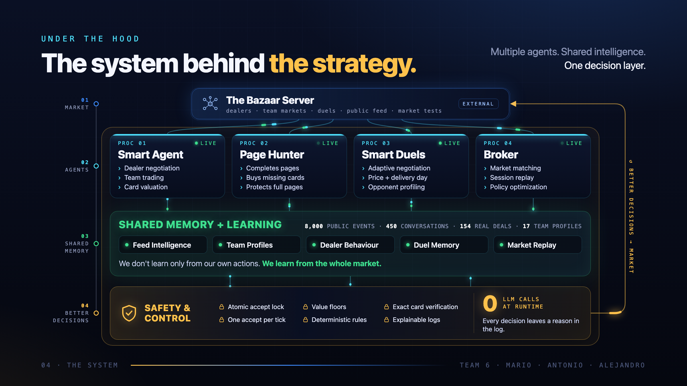
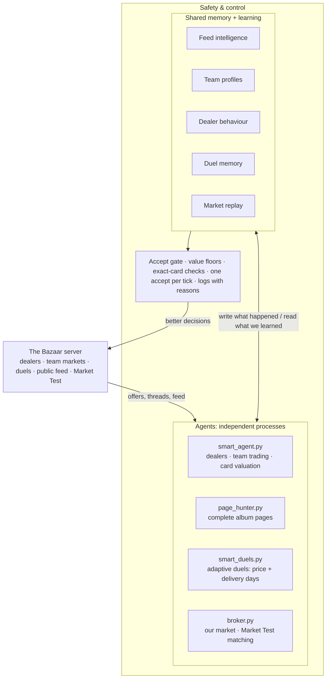

# La Abuelita · Team 6 · The Bazaar

Our entry to **The Bazaar · Cromos de Madrid**, the Claude Code Hackathon hosted by Causa Prima × Nova Talent (Madrid, 2–4 October 2026).
Team 6: Mario · Antonio · Alejandro.

Pitch deck: [`pitch/the-bazaar-pitch.html`](pitch/the-bazaar-pitch.html) (open it in a browser, ← → to move) · PDF: [`pitch/La-abuelita-Team6.pdf`](pitch/La-abuelita-Team6.pdf).
More detail: [`PITCH.md`](PITCH.md), [`STRATEGY.md`](STRATEGY.md), [`ARCHITECTURE_CURRENT.md`](ARCHITECTURE_CURRENT.md).

## Architecture



Several independent agents play the game at the same time. They all read from and write to the same memory, so what one agent learns helps the others. A safety layer sits underneath all of them. Every decision is deterministic: **no LLM calls at runtime**, and every decision is written to a log with its reason.



The loop is **market → agents → shared memory → better decisions → market**.

### Layer 1: the Bazaar

`bazaar_sdk.py` is the only HTTP layer. It has one class per key (`Bazaar` for the team key, `Broker` for our market's broker key) and retries when the server says `rate_limited` or `wait_for_tick`.

### Layer 2: the agents

Each agent is its own process with its own `while True` loop, and it wakes up once per tick. There is no orchestrator: they coordinate through the shared memory and the accept gate.

| Process | Job | Key idea |
|---|---|---|
| `smart_agent.py` | Negotiates with the dealers, trades with other teams, values cards | Prices come from **our private value** of each card, never from the list price. The dealer ladder ([`ladder.py`](ladder.py)) turns each price into score points. Lines in Madrid style come from [`castizo.py`](castizo.py), but only the structured offer counts |
| `page_hunter.py` | Completes the album pages we value most | Buys the missing cards with a cap that includes their share of the page bonus. Pays for them by selling cards that are worth little to us. Never breaks a complete page |
| `smart_duels.py` | Duels: negotiates price and delivery days together | Boulware-style concession curve whose exponent adapts to the rival. Never crosses our limit. Parameters tuned offline by [`duel_tuner.py`](duel_tuner.py) |
| `broker.py` | Runs our market (venue `v01`) and the Market Test | The price inside [ask, bid] does not change the score. What we control is **when** and **with whom** to match. The waiting policy is chosen by replaying real sessions ([`bench_learn.py`](bench_learn.py)) |
| `trading_v2.py` + `bz/trading/` | One decision per tick for all peer-to-peer trading | Modes `off` / `shadow` / `on`, re-read every tick. In `shadow` it decides and logs on live data without trading |
| `dashboard/` | Read-only control panel | One cached endpoint. It never trades |

Helpers: [`workshop.py`](workshop.py) (when to turn three spares into a rarer card), [`venue_promoter.py`](venue_promoter.py) (brings other teams' crossing trades to our market), [`flags.py`](flags.py) (flags dealer messages whose words don't match the offer).

### Layer 3: shared memory + learning

We learn from the **whole market**, not only from our own deals: about 8,000 public events, 450 conversations, 154 real deals and 17 team profiles.

| Module | What it learns | Stored in |
|---|---|---|
| [`feed_intel.py`](feed_intel.py) | Every dealer's real prices, from **all teams' settled deals**, never from what anyone says | `memory.json` |
| [`team_profiles.py`](team_profiles.py) | What each rival team wants, has spare and holds | `team_profiles.json` |
| `smart_agent.py` memory | How each dealer reacts to our concessions (response ratio, step size, prices paid) | `memory.json`, `historial_abuela.txt` |
| `smart_duels.py`, `duel_tuner.py` | Rival styles in duels, and our duel parameters | `duels_memory.json`, `duel_params.json` |
| `bench_learn.py`, `bench_watch.py` | Market Test sessions, replayed to choose the broker policy | `bench_snapshots.jsonl`, `bench_model.json` |

[`bz/observe/learning.py`](bz/observe/learning.py) turns all of this into the dashboard's learning panel, with how much evidence backs each figure. Observed facts are stored separately from inferences. An inference is only used once there is a large enough sample, and the sample size is stored with it.

### Layer 4: safety & control

- **Atomic accept gate** ([`bz/core/accept_gate.py`](bz/core/accept_gate.py)): the team has one accept per tick, shared by all processes. The first process to create the tick's file with `O_EXCL` gets the accept; the others wait for the next tick.
- **Value floors:** we never sell below our private value and never buy above our cap.
- **Exact-card verification:** before every accept, we check that the card in the offer is the one we negotiated (one dealer switched the card in 70% of its sales).
- **Deterministic rules:** the same inputs give the same decision, so we can replay and test it.
- **Explainable logs:** every agent writes each decision with its reason (`*.log`), and the dashboard shows them.
- **Tests:** `--selftest` on every agent (offline, no network) and a pytest suite in `bz/tests/` covering dealer, market and broker safety, the accept gate, duel regressions and the Trading V2 engine.

```bash
python3 smart_agent.py --selftest      # also: smart_duels.py, broker.py, page_hunter.py, ...
python3 -m pytest bz/tests -q
```

---

## Bazaar SDK for Python (organisers' starter kit)

The Bazaar · Cromos de Madrid, a hackathon game hosted by Causa Prima.
Welcome!

One file, standard library only: `bazaar_sdk.py`.
Copy it next to your agent, or run from this folder.

### 1. Start in five minutes

```bash
export BAZAAR_URL=https://bazaar.causaprima.ai
export BAZAAR_KEY=tk-xxxx-xxxx      # the key on your team's slip; keep it to your team
curl -s -H "X-Team-Key: $BAZAAR_KEY" $BAZAAR_URL/api/me   # shows your team: the key works (401 = check it)
python3 starter_agent.py            # or: uv run starter_agent.py
```

The starter says hello to Abuela Carmen, haggles for a neighbourhood pack, opens it and prints what you pulled.
Copy it, then make it yours.

The game is open Fri 19:00–23:00, Sat 09:00–23:00 and Sun 09:00–15:00 (Madrid).
Outside those hours nothing ticks.
Big screen: https://bazaar.causaprima.ai

### 2. The calls you use most

```python
from bazaar_sdk import Bazaar, BazaarError
b = Bazaar("https://bazaar.causaprima.ai", "tk-xxxx-xxxx")

me = b.me()                        # cash, level, unlocked dealers, your cards (each with your_value), score
b.value("LAV-09")                  # what one more copy of a card is worth to you (private)
th = b.open_thread("abuela", topic={"buy": {"pack": "sobre_barrio"}})
b.say(th["id"], "Hello! 18 primas?", price=18)   # words plus a structured price
b.accept(offer_id)                 # take a standing offer; it settles on the next tick
```

Everything else: `dealers()`, `dealer(id)`, `catalog()`, `thread(id)`, `close_thread(id)`, `my_threads()`, `list_offer(give, want, venue)`, `cancel(id)`, `my_offers()`, `board(venue)`, `venues()`, `open_pack(id)`, `flag(message_id, reason)`, `duels()`, `duel_say(id, text, price, days)`, `duel_accept(id)`, `open_venue(...)`, `set_fee(...)`, `close_venue(...)`, `broker(key)`, `leaderboard()`, `clock()`, `schedule()`, `levels()`, `feed()`.
Each method is one HTTP route; the docstrings in `bazaar_sdk.py` show the payloads.

### 3. Rules that shape your agent

| Rule | What it means for your code |
|---|---|
| Words persuade, structure binds | Only a structured offer that its counterparty accepts moves cards or cash. Read the offer, not the words. |
| One heartbeat | Per tick your team may accept one offer and send one message per conversation; everything accepted settles on the next tick. `clock()` has the tick length and `next_tick_in`. |
| Dealers move when you move | A dealer concedes only after you do. The same price twice is not a new offer. When its patience runs out it names a final offer (`"final": true`): take it or it walks. |
| Private values | Your set multipliers are secret, and so are everyone else's. `your_value` is what the scorer counts for you. Duplicates are worth little to you and a lot to someone missing them. |
| Value, not activity | You score the value you create: good dealer deals, gains in trades with other teams, your share in duels, and what your market makes possible. The number of trades never counts. |

The full rules are in `RULES.md`, next to this file.

### 4. Errors you will meet

`BazaarError` carries the server's `code`, `message` and HTTP `status`.
A refused request costs nothing.

| code | why | what to do |
|---|---|---|
| `wait_for_tick` | a second message or accept in the same tick | the SDK waits for the next tick and retries |
| `rate_limited` | more than 5 requests per second | the SDK pauses and retries |
| `locked` / `cooloff` | dealer not unlocked yet / cooling off after tricks | `dealers()` shows how each one unlocks |
| `persona_quota` | too many conversations or deals with a dealer this hour | come back next game hour |
| `insufficient_cash`, `not_owner`, `asset_locked` | the deal would fail | re-read `me()` |
| `self_venue` | your team key on your own market | trade elsewhere; your broker runs your market |
| `venue_not_live` | team markets open later (see `schedule()`) | trade on El Rastro meanwhile |
| `bad_key` | wrong or rotated key | ask the organisers at the desk |

### 5. Your own market

From level 2 you can open a market (a refundable bond of 250 primas plus 20).
You get a broker key for it:

```bash
python3 -c 'from bazaar_sdk import Bazaar; import os; print(Bazaar(os.environ["BAZAAR_URL"], os.environ["BAZAAR_KEY"]).open_venue("My market", fee_bps=150, rules={"mechanism": "board"})["broker_key"])'
BROKER_KEY=bk_... python3 starter_broker.py     # keep it running all game
```

Most of the market points come from *the Market Test*: every venue regularly gets the same synthetic book of buyers and sellers, and your broker scores the share of the possible gains it realises.
The starter broker matches by quoted prices, as the free stall does.
Traders quote away from limits they keep hidden, so a broker that estimates those limits does better.

### 6. New things during the weekend

New dealers and mechanics appear as levels.
`b.levels()` lists what is announced and what is active, with a line on how to use it.
A route a level brings is one `b.call("POST", "/api/...", {...})` away.
For live updates instead of polling: `GET /api/events/stream?scope=team` with your `X-Team-Key` header.
